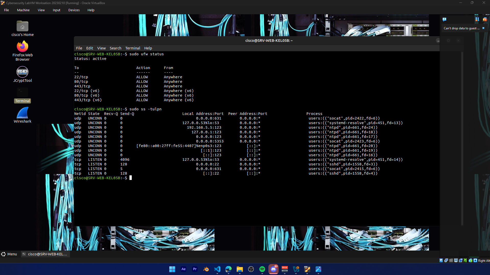
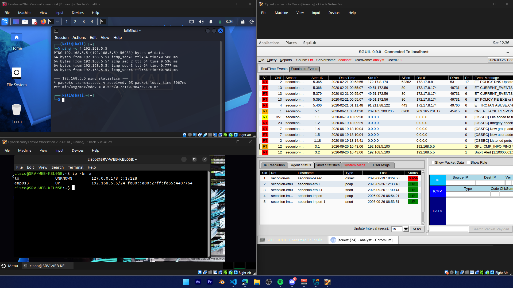

# Baseline Security Report (Fase 1: Hardening Review)
**Mata Kuliah:** TEK1314 Keamanan Siber  
**Kelompok:** Kelompok 05 - Kelas B  

---

## 1. Topologi Jaringan & Identitas Sistem

### 1.1 Diagram Topologi
Jaringan pengujian beroperasi pada segmen subnet `192.168.5.0/24`:

### 1.2 Tabel Identitas Mesin (VM)
| Peran Node | Hostname | IP Address | Subnet Mask | Keterangan / OS |
| :--- | :--- | :--- | :--- | :--- |
| **Node Penyerang (Red Team)** | `kali` | 192.168.5.100 | 255.255.255.0 | Kali Linux (Attacker) |
| **Node Target (Korban)** | `SRV-WEB-KEL05B` | 192.168.5.5 | 255.255.255.0 | Target Server (Ubuntu) |
| **Node Pemantau (Blue Team)** | `SecOnion` | 192.168.5.200 | 255.255.255.0 | Security Onion (NIDS) |

---

## 2. Implementasi Hardening (Sistem Before Attack)

Sebelum memasuki fase pengujian eksploitasi, sistem target telah diperkuat melalui tahapan:
1. **System Hardening:** Menonaktifkan layanan dan port berbahaya yang tidak diperlukan, yaitu layanan Telnet (`xinetd` / Port 23) dan FTP (`vsftpd` / Port 21).
2. **Network Hardening (UFW Firewall):** Menerapkan aturan *Default Deny Incoming* di mana seluruh port ditutup secara default kecuali port esensial: Port 22 (SSH), Port 80 (HTTP), dan Port 443 (HTTPS).
3. **Standardisasi Identitas:** Hostname server telah disesuaikan menjadi `SRV-WEB-KEL05B`.

**Bukti Audit Port & Status Firewall Target:**

---

## 3. Bukti Verifikasi Logging Minggu ke-5 (Security Onion)

Sensor NIDS pada Security Onion (`seconion-eth0`) telah aktif memantau lalu lintas kabel jaringan secara *live* dan *real-time* menggunakan antarmuka promiscuous.

Pengujian transmisi paket ICMP (Ping) dari Node Penyerang (`192.168.5.100`) ke Server Target (`192.168.5.5`) berhasil dideteksi dan dicatat secara langsung di dashboard Sguil:

* **Sensor:** `seconion-eth0` (Status: UP)
* **Source IP:** 192.168.5.100 (Kali Linux)
* **Destination IP:** 192.168.5.5 (Server Target)
* **Signature Alert:** `GPL ICMP_INFO PING *NIX`

---

## 4. Kesimpulan Kesiapan Baseline
Infrastruktur Fase 1 siap 100%. Firewall dan penonaktifan port berhasil memperkecil bidang serangan (*attack surface*), dan Security Onion terbukti mampu mendeteksi aktivitas jaringan secara real-time.